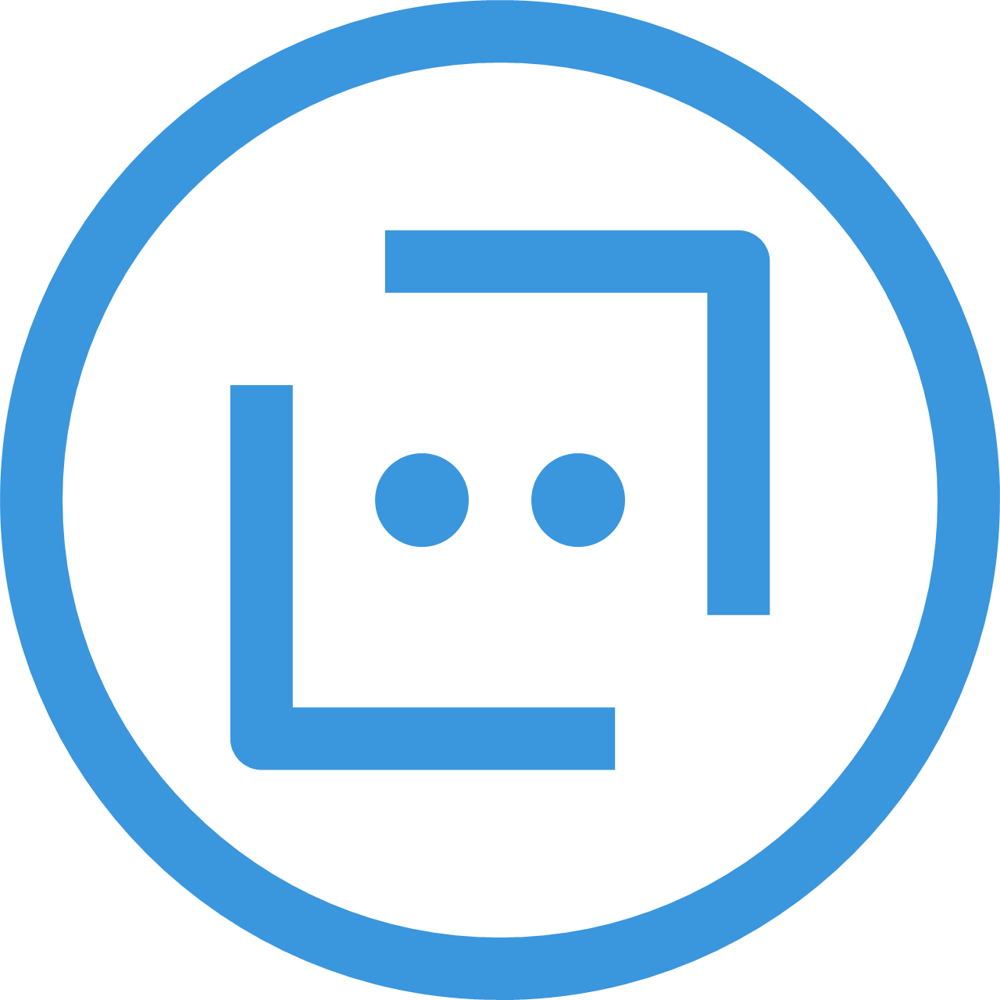
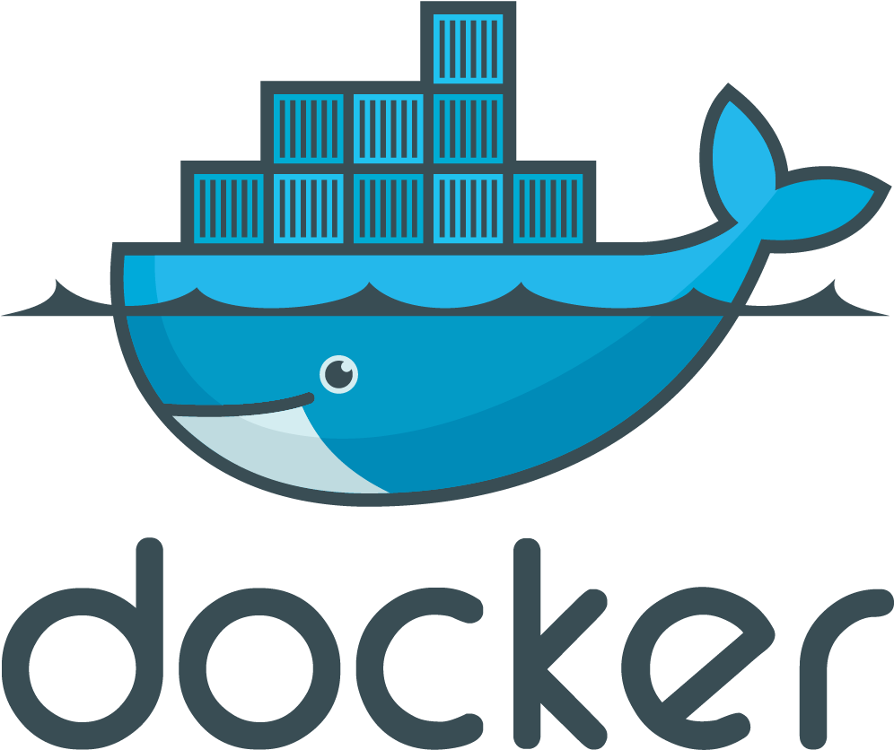

<!-- - 👋 Hi, I’m @BlackDranzer777
- 👀 I’m interested in Software Development, Chatbot Development and Block Chain.
- 🌱 I’m currently learning React.
- 📫 Reach me out at my e-mail divyanshjn23@gmail.com -->

<h2 align="center">Hi 👋, I'm Divyansh Jain</h2>
<h3 align="center" style="font-size:20px;">Developer</h3>

 
### I am...
* 🔭 Currently working on **[Social Media App (timeless)](https://github.com/BlackDranzer777/social-media-app)**
* 🔭 Currently working on **[Dobby (a chatbot)](https://github.com/BlackDranzer777/Dobby)**
* 🌱 Currently learning French and preparing for DELF B1**
* 🌱 Currently learning React**
* 🎓 Graduate of Poornima College of Engineering (2016-2020)
* 📄 Get to know more about me **[CV](https://github.com/BlackDranzer777)**

<!-- ### Recent achievements and Certifications 🏆 -->

<!-- * 🥉  -->

### Languages and Frameworks

 

 
 
 
<!--  -->

<!--  -->
<!-- https://github-readme-stats.vercel.app/api?username=anuraghazra&hide=contribs,issues -->

 
 

<!---
BlackDranzer777/BlackDranzer777 is a ✨ special ✨ repository because its `README.md` (this file) appears on your GitHub profile.
You can click the Preview link to take a look at your changes.
--->
