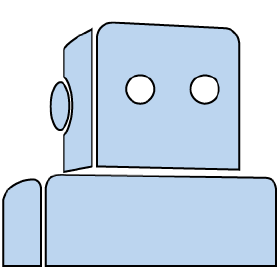

<h2 align="center">Hi 👋, I'm Divyansh (aka BlackDranzer)</h2>
<h4 align="center">Full-Stack Developer | React • Node.js • Python</h4>

  

---

### 👨‍💻 About Me
- 🎓 Master’s student in **Information Technology** at **Warsaw University of Technology**
- 💻 Full-stack developer with strong focus on **React, Node.js, and APIs**
- 🧠 Interested in **system design, security, and scalable web applications**
- 🎹 Learning to play the keyboard (slowly but consistently)
- 🌐 Know more about me: **[Portfolio](https://divyansh-jain.com)**

---

### 🛠️ Tech Stack

  
  
  
  
  
  
  
  
  
  

 

  
  
  

---

### 📊 Languages Used

  

---

⭐ *I enjoy building clean, practical solutions and continuously improving my engineering fundamentals.*
